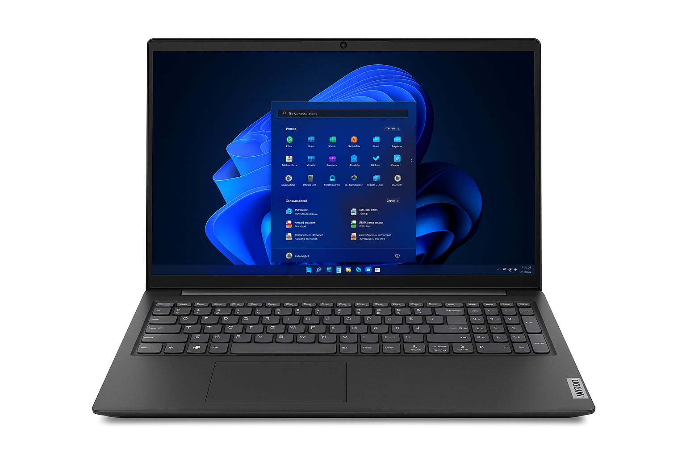

# Projeto-de-Moderniza-o-Tecnol-gica-Aquisi-o-de-Notebooks-para-o-Polo-UAB-Amontada
# RESUMO EXECUTIVO
O objetivo geral ddo projeto é intesificar e ampliar a educação digital no polo UAB na cidade de Amontada, o projeto visa subistituir as maquinas que existem neste laborátorio por notebooks modernos.***com um orçamento total á cerca de R$202.600,00***.  a conclusão dessa proposta acarretará em  benefícios a todos envolvidos sejam ele(a)s professores,alunos,cordenenadores de polo, tutores entre outros e são de durabilidade á curto e longo prazo, alcançando niveís elevados de aprendizado pois ás aulas passarão a ser mais dinâmicas, com possíbilidades de ser tanto presencial como on-line auxiliando no ganho de experiência e adaptação de novas técnicas de ensino.

# 2.APRESENTAÇÃO E JUSTIFICATIVA
Na cidade de Amontada está localizado um polo da Universidade Aberta do Brasil (UAB), que conta com um laboratório de informática composto por aproximadamente 27 computadores do modelo desktop. Entretanto, parte dessas máquinas encontra-se inoperante e, entre as que ainda funcionam, muitas já se tornaram obsoletas.

Considerando o avanço tecnológico atual, diversas ferramentas educacionais demandam maior capacidade de memória RAM e processadores que suportem aplicações modernas. A ausência de uma infraestrutura adequada compromete diretamente a qualidade do ensino e prejudica o aprendizado, ampliando a desigualdade social no acesso à tecnologia, ou seja, impede que recursos tecnológicos cheguem a outros espaços.

A substituição dos equipamentos atuais por novos dispositivos é, portanto, essencial para fortalecer a educação no município. Essa medida solucionaria a falta de processadores potentes e possibilitaria aulas mais dinâmicas, leves e adaptáveis a diferentes ambientes. Além disso, a troca dos desktops por notebooks permitiria a adoção de um sistema de ensino híbrido, contemplando tanto aulas presenciais quanto online, de forma mais eficiente e inclusiva.
# 3. OBJETIVOS
os objetivos específicos são;
## 1.Aumentar a Capacidade de Processamento;
Com a troca desses equipamentos, viabiliza-se um conjunto de novas possibilidades de aprendizado técnico, criando condições mais adequadas para o uso de ferramentas modernas e, consequentemente, contribuindo para a melhoria do desempenho dos estudantes.
## 2. disponibilizar opções e métodos diferentes de ensino;
Com a adoção desses novos equipamentos, será possível criar condições que favorecem o desenvolvimento de um modelo de ensino híbrido, permitindo que as aulas sejam realizadas tanto de forma presencial quanto online, sem a necessidade de que alunos e professores estejam restritos a um local específico.
## 3. redução e economia dos custos operacionais;
Em comparação do consumo de energia dos antigos computadores aos que irão substitui-los, há uma diferença de cerca de Por máquina/mês: Desktop 14,08 kWh vs Notebook 4,40 kWh → –69% (economia 9,68 kWh). 27 máquinas/mês: Economia 261,36 kWh (≈ –69%). 
## 4. imerção e preparação para o mercado de trabalho;
Ao adquirir experiência com os novos equipamentos, os estudantes poderão desenvolver suas habilidades técnicas de forma prática e significativa.
Isso ajuda a aumentar a confiança e a autonomia no uso da tecnologia.
Eles também passam a ter mais facilidade para se adaptar a diferentes situações do mundo moderno.
# 4.FICHA COMPLETA DOS NOTEBOOKS
De acordo com a proposta, abaixo vão estar detalhadamente todas as características que compõem este modelo de notebook
| Especificação       | Mínimo                                      | Recomendado         |
|---------------------|---------------------------------------------|----------------------------------------------|
| *Processador*     | Intel i3 (8ª geração+) ou AMD Ryzen 3       | Intel i5 (10ª geração+) ou AMD Ryzen 5       |
| *Memória RAM*     | 8 GB                                        | 16 GB (ou expansível)                        |
| *Armazenamento*   | SSD 240 GB                                  | SSD 512 GB (ou 256 GB + HD secundário)       |
| *Tela*            | 14”/15,6” Full HD (1920×1080)               | 15,6” Full HD, painel IPS                    |
| *Sistema*         | Windows 10/11 ou Linux                      | Windows 11 Pro / Linux / ChromeOS            |
| *Bateria*         | 4–6 horas                                   | 8–10 horas                                   |
| *Rede*            | Wi-Fi 5 (802.11ac) + entrada para cabo LAN  | Wi-Fi 6 + Bluetooth 5.0 ou superior          |
| *Extras*          | Webcam HD + microfone básico                | Webcam Full HD + microfone com redução de ruído|

está listado os requisítos ideais para uma experiência educacional satisfatoria.
**Exemplo de modelo compatível:**

*Figura 1 – Notebook Lenovo IdeaPad Slim 3i, modelo que atende às especificações recomendadas.*

**Referências externas:**
- [Lenovo IdeaPad Slim 3i – Site oficial](https://www.lenovo.com/br/pt/p/laptops/ideapad/ideapad-slim-3i)  
- [Artigo: Benefícios do uso de notebooks na educação](https://www.educacao.sp.gov.br)
- ---

## 5. Orçamento Estimado

| Item                       | Quantidade | Valor Unitário (R$) | Valor Total (R$) |
|----------------------------|------------|----------------------|------------------|
| Notebook                   | 30         | 5.500,00             | 165.000,00       |
| Seguro contra acidentes    | 30         | 400,00               | 12.000,00        |
| Sistema de rastreamento    | 30         | 250,00               | 7.500,00         |
| Licenças de Software       | 30         | 300,00               | 9.000,00         |
| Bolsas/Cases de Proteção   | 30         | 150,00               | 4.500,00         |
| Roteador Wi-Fi             | 2          | 800,00               | 1.600,00         |
| Instalação/Configuração    | 1 serviço  | 3.000,00             | 3.000,00         |
| **TOTAL GERAL ESTIMADO**   |            |                      | **202.600,00**   |

---

## 6. Benefícios Esperados
- Aulas em diferentes ambientes da escola, sem depender de um único laboratório fixo.  
- Redução significativa do consumo de energia elétrica em comparação com desktops.  
- Maior engajamento dos estudantes, com acesso facilitado a metodologias ativas e ensino híbrido.  
- Modernização da infraestrutura tecnológica do Polo UAB Amontada.  
- Maior durabilidade e menor custo de manutenção a longo prazo.  

---

## 7. Cronograma Simplificado

| Etapa              | Prazo Estimado |
|--------------------|----------------|
| Planejamento       | 4 semanas      |
| Processo de compra | entre 2 e 3 semanas |
| Instalação         | 3 semanas      |
| Treinamento        | 4 semana       |
| Implantação        | 3 semanas      |

---

## 8. Considerações Finais
Este projeto tem como objetivo modernizar a infraestrutura tecnológica do Polo UAB Amontada, substituindo computadores obsoletos por notebooks modernos, eficientes e versáteis. O investimento á curto e longo prazo trará benefícios duradouros para alunos, professores e para a gestão escolar, garantindo mais flexibilidade, economia e qualidade no processo de ensino-aprendizagem. A escolha pelos notebooks representa a solução ideal para acompanhar as demandas da educação contemporânea e preparar o Polo para o futuro.

---
